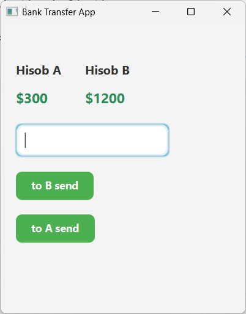
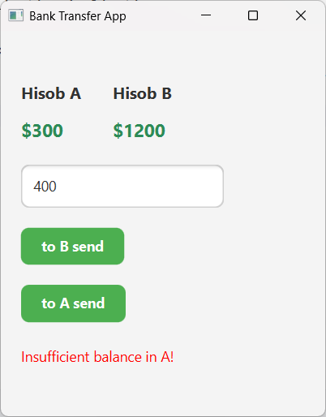
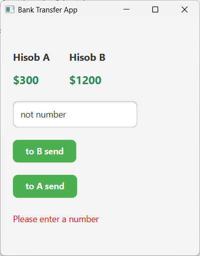
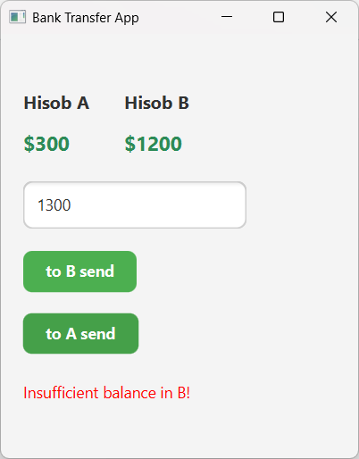

📌 Bank Transfer App (JavaFX)

JavaFX orqali yaratilgan oddiy, lekin funksional pul o‘tkazma (transfer) dasturi.
Foydalanuvchi hisoblar orasida mablag‘ o‘tkazishi, balansni ko‘rishi va noto‘g‘ri qiymat kiritganda xatolik olishi mumkin.

🚀 Xususiyatlar

🔄 Hisob A → Hisob B ga pul o‘tkazish

🔄 Hisob B → Hisob A ga pul o‘tkazish

💵 $1200 ko‘rinishidagi balanslardan raqamni avtomatik ajratib olish

❗ Yaroqsiz son yoki balans yetarli bo‘lmagan holatda xatolik chiqarish

🎨 Chiroyli JavaFX UI (CSS bilan)

